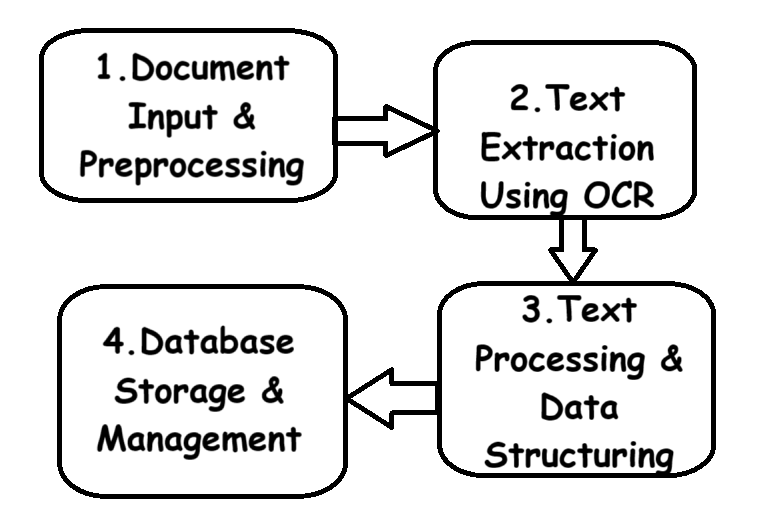
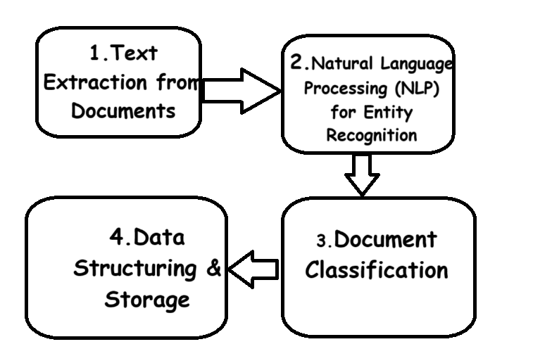
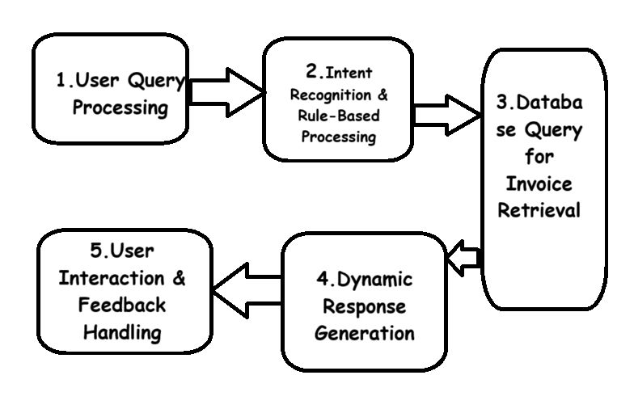

# Intelligent-Process-Automation

This project addresses key challenges that enterprises face in automating their repetitive and error-prone tasks, enabling them to increase operational efficiency and drive business growth. In industries where large-scale data processing, document handling, and customer interaction are central, automation can drastically improve outcomes. The implementation of Tesseract OCR for data entry not only accelerates the data intake process but also minimizes human error, allowing for more accurate and reliable data handling. The use of SQL databases facilitates seamless data storage and retrieval, enhancing both performance and scalability. Document processing automation further optimizes business workflows by reducing the need for manual review and categorization of documents, saving valuable time and resources. Finally, chatbot-driven customer service automation helps businesses scale their support operations, providing real-time responses to customers while lowering operational costs. These solutions ultimately enable enterprises to focus on strategic growth, enhance customer experience, and remain competitive in a rapidly evolving market.

# **Overview**

Intelligent Process Automation applies cutting-edge AI and machine learning techniques to automate business processes. The following algorithms and tools have been implemented:

**1. Data Entry Automation**: Utilizes Tesseract OCR for optical character recognition (OCR) to extract text from images. Regular expressions are employed for structured data extraction, and data is stored and managed in an SQL database to streamline data entry workflows.

**2. Document Processing Automation**: Applies OCR (alternative to Tesseract) to extract textual data from documents, followed by categorization and basic text analysis.

**3. Customer Service Automation**: Implements a chatbot using a rule-based system to handle customer queries, automating responses based on predefined inputs.

# **Technologies Used**

**Tesseract OCR**: Used for Optical Character Recognition to extract text from images in the Data Entry Automation phase.

**SQL Database**: Used to store, manage, and retrieve structured data in the Data Entry Automation phase.

**Python**: The primary programming language for implementing the automation solutions.

**OpenCV (cv2)**: For image processing to enhance text extraction accuracy.

**SQLite3**: For managing local databases in the project.

**Regular Expressions (re)**: For structured data extraction and validation.

**CSV**: For managing and manipulating data in CSV format.

**scikit-learn (sklearn)**: For any machine learning models or techniques used.

**Rule-Based Chatbot (Python & Regex)**: For implementing customer service automation and providing rule-based interactions.

# Installation

To set up the project locally, follow these steps:

### 1.Clone the Repository:

git clone https://github.com/gargi137/intelligent-process-automation.git
cd intelligent-process-automation

### 2.Set up a Virtual Environment :

python3 -m venv venv
source venv/bin/activate  # On Windows: venv\Scripts\activate

### 3.Install Dependencies: 
Create a requirements.txt file with all necessary libraries:

pip install -r requirements.txt

such as:

Tesseract

OpenCV (cv2)

NumPy

Regular Expressions (re)

SQLite3

CSV

NLTK

spaCy

scikit-learn (sklearn)

### 4.Set up the database:

Ensure you have the necessary database (e.g., MySQL, SQLite) set up locally or remotely.

Update the connection details in your code (use environment variables if needed).

# Workflow Diagrams:

## Data Entry Automation Workflow diagram:

## Document Processing Automation Workflow Diagram:

## Customer Service Interactions Workflow Diagram:

## Future Work

##### 1. Enhanced Document Processing:
Implement advanced machine learning techniques like Natural Language Processing (NLP) for more accurate document categorization and data extraction.

##### 2. Chatbot Enhancement: 
Integrate NLP and deep learning models to enable the chatbot to understand and respond to a wider range of customer queries with more flexibility.

##### 3. Scalability: 
Optimize the database and automation processes to handle larger volumes of data and more complex workflows.

##### 4. Integration with Cloud Services: 
Consider integrating the solution with cloud-based tools for better scalability and accessibility.

# Acknowledgments

**Tesseract OCR**:
For enabling efficient optical character recognition in the Data Entry Automation phase.

**SQL Database**: 
For managing and storing structured data in a scalable way.

**OpenCV**:
For image processing, improving the accuracy of text extraction.

**Python Libraries**:
For various utilities and functionalities used throughout the project, including numpy, re, and flask.

Special thanks to the contributors and community behind these tools for making this project possible

